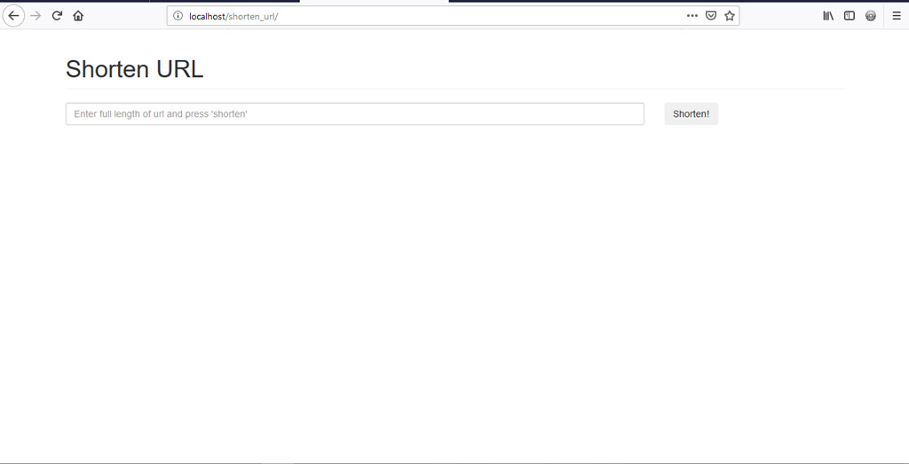
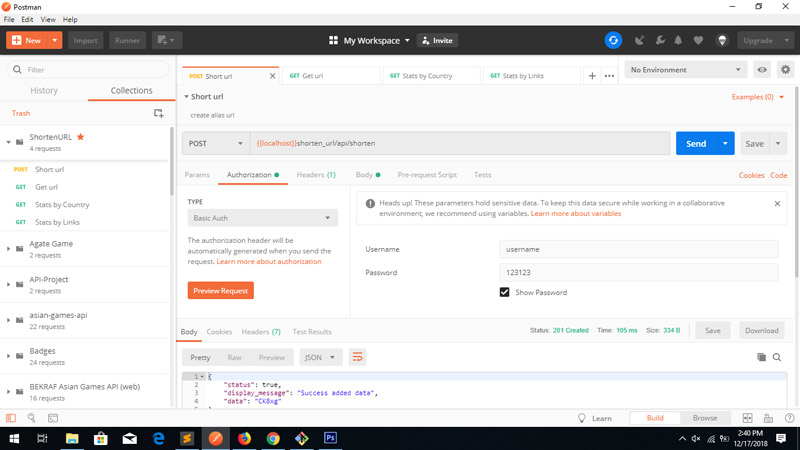
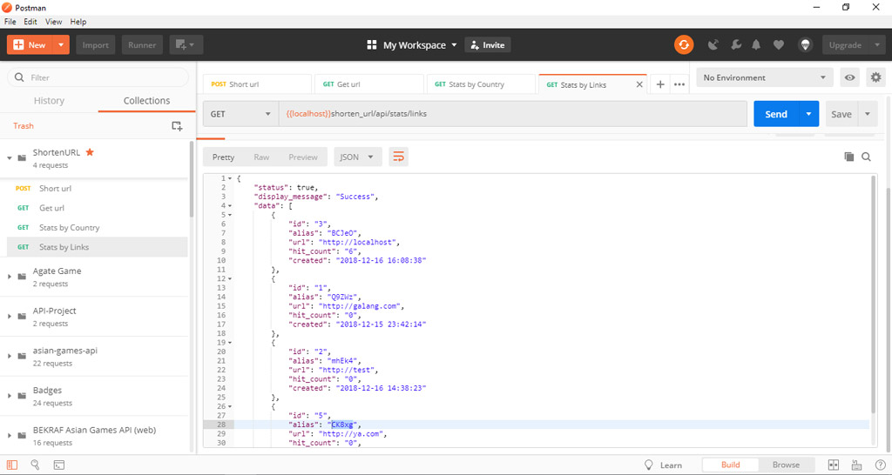

# Shorten URL with Stats 


## Getting Started

These instructions will get you a copy of the project up and running on your local machine for development and testing purposes. See deployment for notes on how to deploy the project on a live system.

### Prerequisites

```
PHP 7+
Apache server
MySQL
```

### Installing

```
install to local repository and create database name 'dbshortener', and import all query inside
import end point collection and environment using postman application
```

### Feature

* Access from either browser and mobile
	
	

	using basic auth access
	```
	/api/shorten 
	```
	with url parameter body, you can shorten your url

	


	Sure with the reversing method you can extract your alias url become redirect link
	
	```
	/api/shorten/(alias)
	```

	Example : 
	```
	/api/shorten/B8ufy
	/api/shorten/1UfrT
	```


* view statistic 'URL Rank' and 'COUNTRY from rank'
	
	* Stats by most links

		via browser

		``` 
		/view/stats
		```


		via api

		```
		/api/stats
		```

	

	* Stats by most country from

		via browser		

		```
		/view/stats/country
		```


		via api

		```
		/api/stats/country
		```


### Built With

* [Codeigniter 3.1.9](https://www.codeigniter.com/) with
* [Codeigniter RestServer](https://packagist.org/packages/chriskacerguis/codeigniter-restserver)


## Authors

* **Meyliana Pratama**

## License

This project is free license
